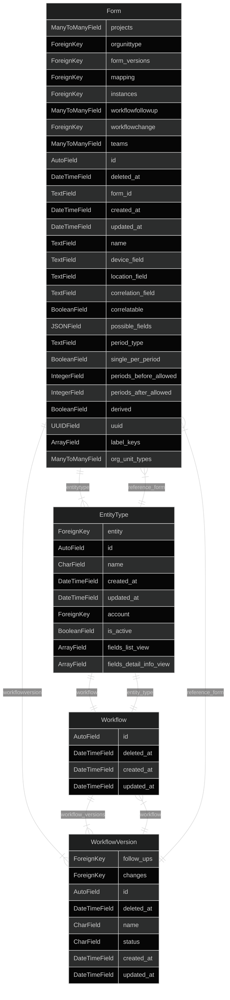

## hat's ER Diagram

```mermaid
%%{init: {'theme': 'dark' } }%%
erDiagram
Form{
ManyToManyField projects
ForeignKey orgunittype
ForeignKey form_versions
ForeignKey mapping
ForeignKey instances
ManyToManyField workflowfollowup
ForeignKey workflowchange
ManyToManyField teams
AutoField id
DateTimeField deleted_at
TextField form_id
DateTimeField created_at
DateTimeField updated_at
TextField name
TextField device_field
TextField location_field
TextField correlation_field
BooleanField correlatable
JSONField possible_fields
TextField period_type
BooleanField single_per_period
IntegerField periods_before_allowed
IntegerField periods_after_allowed
BooleanField derived
UUIDField uuid
ArrayField label_keys
ManyToManyField org_unit_types
}
EntityType{
ForeignKey entity
AutoField id
CharField name
DateTimeField created_at
DateTimeField updated_at
ForeignKey account
BooleanField is_active
ArrayField fields_list_view
ArrayField fields_detail_info_view
}
Workflow{
AutoField id
DateTimeField deleted_at
DateTimeField created_at
DateTimeField updated_at
}
WorkflowVersion{
ForeignKey follow_ups
ForeignKey changes
AutoField id
DateTimeField deleted_at
CharField name
CharField status
DateTimeField created_at
DateTimeField updated_at
}
Form||--|{EntityType : entitytype
Form||--|{WorkflowVersion : workflowversion
EntityType||--||Workflow : workflow
EntityType||--|{Form : reference_form
Workflow||--|{WorkflowVersion : workflow_versions
Workflow||--||EntityType : entity_type
WorkflowVersion||--|{Workflow : workflow
WorkflowVersion||--|{Form : reference_form
```
